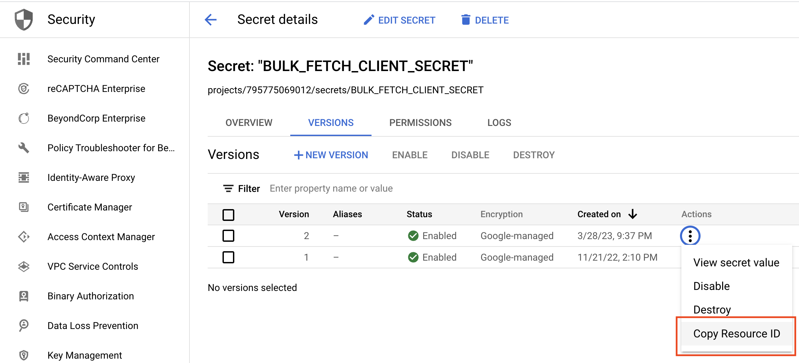
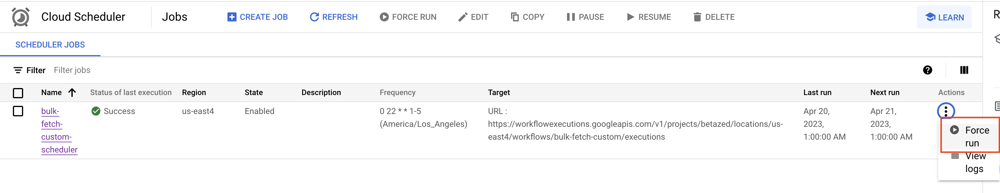
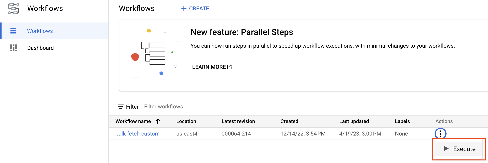
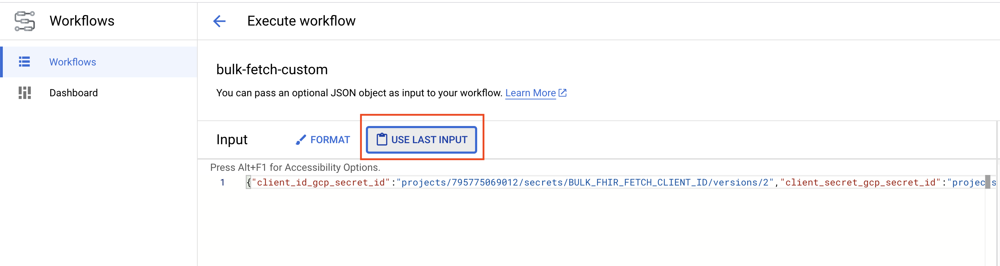

# Bulk FHIR Fetch Orchestration

This folder contains scripts to set up Bulk FHIR data ingestion as a
periodic [Cloud Batch job](https://cloud.google.com/batch/docs/get-started) in
your GCP environment using [`gcloud`](https://cloud.google.com/sdk/gcloud) and
[GCP Workflows](https://cloud.google.com/workflows). Because Cloud Batch is used, no persistent VM is required to run.

Note: For now, these workflows can only be used with client ID and client
secret authentication. JWT based authentication support coming soon.

## Overview
The [deploy_and_schedule_workflow.sh](deploy_and_schedule_workflow.sh) is the
primary script you will run in order to set up periodic ingestion. The script
only needs to be run once to set up your configuration.

At a high level this script sets up the following:

* A GCP Workflow that will:
   * Run `bulk_fhir_fetch` as a Cloud Batch job
   * Create any necessary GCP buckets if needed based on specified flags.
   * Fetch Client ID/Secret values from the
    [GCP Secret Manager](https://cloud.google.com/secret-manager).
* A Cloud Scheduler which will trigger the `bulk_fhir_fetch` GCP Workflow on
  the schedule you prescribe, and with the flag configuration you specify in the
  script.
* (optional) If specified in the script, a instance template with a static IP
  address will be created so the `bulk_fhir_fetch` job will run with a
  prescribed static IP (needed for some production FHIR servers like BCDA--
  though their sandbox does not require it).

## Usage

Note the user who will run this script will likley need many administrative
privliges in the project, including the ability to create workflows, schedulers,
and have the iam.serviceAccounts.actAs permission for the service account you'd
like to run the batch jobs for (see
[deploy_and_schedule_workflow.sh](deploy_and_schedule_workflow.sh) for more details).

1. Install [`gcloud`](https://cloud.google.com/sdk/docs/install) on the computer
   you will use to run
   [deploy_and_schedule_workflow.sh](deploy_and_schedule_workflow.sh).
1. Follow the `gcloud` init
   [setup](https://cloud.google.com/sdk/docs/initializing). If you already have
   gcloud installed, be sure to run at least:

   ```
   gcloud auth login
   gcloud config set project $YOUR_PROJECT
   ```

1. Get the [deploy_and_schedule_workflow.sh](deploy_and_schedule_workflow.sh)
   script and workflow to this computer by cloning the repository:

   ```
   git clone https://github.com/google/medical_claims_tools.git
   ```

1. Add your client ID and client secret to the
   [GCP Secret Manager](https://console.cloud.google.com/security/secret-manager).

1. Copy the "Resource ID" of the Client ID and Client Secret by clicking on them
   in the Secret Manager, pressing the three dots on the latest version, and
   clicking "Copy Resource ID." Then, copy these into the corresponding
   locations in your copy of the deploy_and_schedule_workflow.sh script:

   https://github.com/google/medical_claims_tools/blob/60c02ead8df830a2c8cb1903451bb415c3b579eb/orchestration/deploy_and_schedule_workflow.sh#L69-L70
  

1. Open the [deploy_and_schedule_workflow.sh](deploy_and_schedule_workflow.sh)
   script in a text editor, and begin to fill out the variables in the
   "Configurable Variables" section according to the directions listed in the
   script.

1. Run the script once to get your periodic job setup
   ```
   ./deploy_and_schedule_workflow.sh
   ```

  Once it is run once successfully, you should be good to go! If you need to
  edit any parameters, you can edit this script and re-run it as needed. Since
  no actual secret text is included in the script, you may choose to version
  control your version of the script.

## FAQs

* Q: How do I run one-off runs of the job?

  A: This can be done by forcing a run from [Cloud Scheduler](https://console.cloud.google.com/cloudscheduler), which will run the job with the parameters you supplied at the time you ran the [deploy_and_schedule_workflow.sh](deploy_and_schedule_workflow.sh) script.
  

  If you want to run the job with a one-off set of parameters you can also go to
  the [Cloud Workflows page](https://console.cloud.google.com/workflows) and
  * Select the three dots near the workflow you wish to run, select "Execute" then
  "Use last input"
  * Edit the input to the job as you desire before
  running the workflow.

  
  
